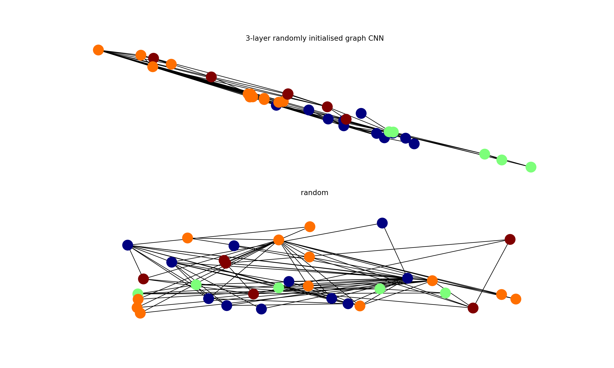
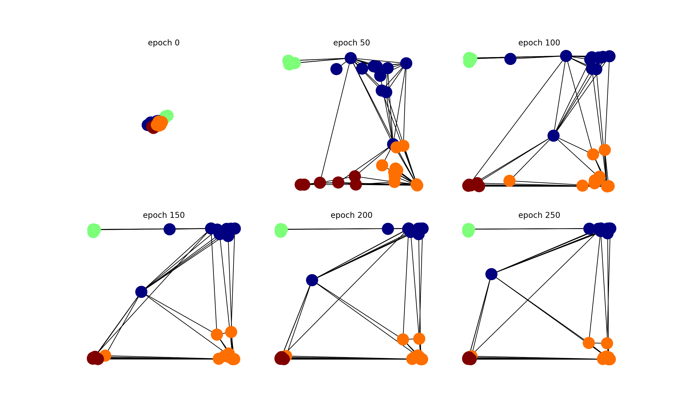

Forked from "https://github.com/dbusbridge/gcn_tutorial". Ported to work with Tensorflow 2.2

# A tutorial on Graph Convolutional Neural Networks

## Data

The data we use is [Zachary's karate club](https://en.wikipedia.org/wiki/Zachary%27s_karate_club), a standard toy social network. It is a data set consisting of:

+ 34 nodes, each corresponding to members of a karate club

+ 78 pairwise links that correspond to social interactions of the members outside of the club.

A conflict arose in the club which caused the club to split into several factions. Using modularity based clustering, these factions can be recovered from the graph structure alone (except for one node).

## Code

+ `R/` contains the code necessary to produce the `graphml` representation of the karate club network,

+ `layers/graph.py` contains the TensorFlow 2.2 implementation of the Graph Convolutional Layer,

+ `utils/sparse.py` contains helper functions for dealing with sparse matrices,

+ `karate_supervised.py` and `karate_unsupervised.py` are two python scripts that demonstrate how Graph Convolutional Neural Networks perform in an unsupervised and semi-supervised manner, following the appendix of http://arxiv.org/abs/1609.02907.

## Requirements

This project is built for running on an [poetry](https://python-poetry.org/) virtual environment. I will add support for alternative setups later. All experiments are run on python3.7

## Setup

+ Clone the repository.

+ Install [asdf](https://asdf-vm.com). *asdf* allows us to manage multiple runtime versions such for different languages such as `nvm`, `rbenv`, `pyenv`, etc using a CLI tool
    * Install asdf using this [guide](https://asdf-vm.com/#/core-manage-asdf-vm?id=install)
	* Now install `python3.7`
	```bash
	asdf plugin add python
	asdf install python 3.7.0
	asdf local python 3.7.0	# sets python3.7 as interpreter for the project
	```
+ Install poetry. [Poetry](https://python-poetry.org/docs/) is a python dependency management & packaging tool. Allows us to declare project libraries dependency & manage them
	```bash
	asdf plugin add poetry
	asdf install poetry 1.1.1
	asdf local poetry 1.1.1
	```

+ Create the virtual environment

```
poetry install
```

## Running the scripts
```
poetry run python karate_semisupervised.py
```

And you're ready to go!

**Unsupervised Experiment**



**Semisupervised Experiment**



## Original implementation of Graph Convolutional Neural Networks

For the original TensorFlow implementation (in a Keras style) see https://github.com/tkipf/gcn.

## References

### Blog posts

+ Great introductory post https://tkipf.github.io/graph-convolutional-networks/
+ Graph Convolution Networks - https://medium.com/ai-in-plain-english/graph-convolutional-networks-gcn-baf337d5cb6b

### Papers

+ Defferrard, M., Bresson, X., & Vandergheynst, P. (2016). Convolutional Neural Networks on Graphs with Fast Localized Spectral Filtering. Nips, (Nips), 1–14. http://arxiv.org/abs/1606.09375

+ Kipf, T. N., & Welling, M. (2016). Semi-Supervised Classification with Graph Convolutional Networks, 1–14. http://arxiv.org/abs/1609.02907

+ Kipf, T. N., & Welling, M. (2016). Variational Graph Auto-Encoders. Nipsw, (2), 1–3. http://arxiv.org/abs/1611.07308

+ Berg, R. van den, Kipf, T. N., & Welling, M. (2017). Graph Convolutional Matrix Completion. https://arxiv.org/pdf/1706.02263.pdf

+ Schlichtkrull, M., Kipf, T. N., Bloem, P., Berg, R. van den, Titov, I., & Welling, M. (2017). Modeling Relational Data with Graph Convolutional Networks, 1–12. http://arxiv.org/abs/1703.06103
